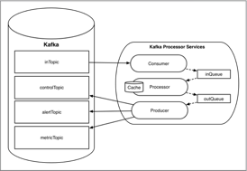
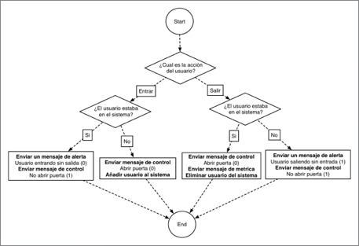

# kafka-subway

En esta práctica vamos a trabajar en un sistema que se encarga de procesar los eventos de un sistema de control de entrada de una estación de metro. Para ello, las puertas de la estación de metro nos envían un mensaje cada vez que un usuario entra y sale del metro. El mensaje es recibido en un sistema, convertido a formato JSON y enviado a un topic de Kafka (inTopic). En la figura inferior tenemos un ejemplo del formato de mensaje de entrada, donde podemos encontrar:

* timestamp: Marca de tiempo en formato UNIX.
* user_id: Identificador único de cada usuario.
* action: Acción que realiza el usuario: 0 entrar al metro, 1 salir del metro.
* full_name: Nombre y primer apellido del usuario.

```json
{"InMessage" :{
    "timestamp": 1448125286,
    "user_id": "ADB123456",
    "action": 0,
    "full_name": "Andres Gomez"
}}
```

A partir del mensaje de entrada, deberemos generar 3 tipos de mensajes:

* **Mensajes de control**: Los mensajes de control son generados siempre que recibamos un mensaje de entrada, en el mensaje de control indicamos si la puerta del metro debe abrirse o permanecer cerrada. La puerta del metro deberá abrirse siempre que se detecte que el usuario intenta entrar y no se encontraba ya en el interior del metro o que el usuario intente salir del metro y con antelación hayamos recibido un evento de entrada.
    
    `ABRIR PUERTA (0) - NO ABRIR PUERTA (1)`
* **Mensajes de métricas**: Los mensajes de métricas se enviaran únicamente cuando se reciban mensajes con la acción de salida, y se haya recibido un mensaje de entrada con anterioridad. Los mensajes de métrica deberán indicar la duración de tiempo (segundos) que el usuario ha permanecido dentro del metro. Para ello deberemos almacenar los mensajes de entrada en una cache interna.
* **Mensajes de alerta**: Los mensajes de alerta se envían cuando se detecta que un usuario intenta salir del metro pero no se encontraba en su interior o viceversa.

    `ENTRAR SIN SALIR (0) - SALIR SIN ENTRAR (1)`

En las figuras inferiores tenemos un ejemplo tipo de cada mensajes: control, métrica y alerta.

```json
{"ControlMessage" :{
    "timestamp": 1448125286,
    "user_id": "ADB123456",
    "full_name": "Andres Gomez”,
    "action": 0
}}
```

```json
{"MetricMessage" :{
  "timestamp": 1448125286,
  "user_id": "ADB123456",
  "full_name": "Andres Gomez”,
  "duration": 600
}}
```

```json
{"AlertMessage" :{
  "timestamp": 1448125286,
  "user_id": "ADB123456",
  "full_name": "Andres Gomez”,
  "action": 1
}}
```

En la figura inferior, podemos ver un esquema lógico de cómo va a funcionar nuestro servicio. A la izquierda tenemos un broker de Kafka donde hemos creado todos los necesarios topics: **inTopic**, **controlTopic**, **alertTopic** y **metricTopic**. Y a la derecha, encontramos nuestro programa que consta de 3 procesos principales:


* **Consumer**: El consumidor es el encargado de leer los mensajes que se escriban en el topic de kafka (inTopic). Los mensajes, que tienen formato JSON, son parseados e introducidos en una cola en memoria denominada inQueue;
* **Processor**: El procesador va leyendo los mensajes de la cola de entrada (inQueue) y gracias a ellos realiza cierta lógica, generando 3 tipos de mensajes: control, alerta y métrica. Todos los mensajes son almacenados en la cola de salida (outQueue). El procesador tiene una cache interna que es utilizada en la lógica del sistema para poder verificar si un usuario estaba antes o no en el metro y para calcular la duración que un usuario permanece dentro del metro.
* **Producer**: Finalmente, el productor obtiene los mensajes procesados de la cola de salida, los transforma de nuevo a formato JSON y los envía a su topic correspondiente (control, alerta o métrica).




